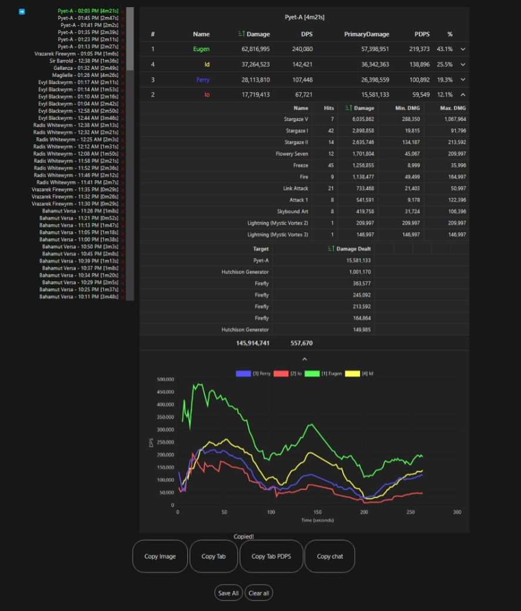

# gbfr-parser

## Download

You can download the latest version [here](https://github.com/brunolm/gbfr-parser/releases).

## Install

Pre-requirements:

- Python 3.11 or above - [Download here](https://www.python.org/ftp/python/3.11.6/python-3.11.6-amd64.exe)
  - Make sure to enable "Use admin privileges when installing py.exe"
  - **and "Add Python to environment variables" or "Add python.exe to PATH"** during the installation.

After obtaining latest [release](https://github.com/brunolm/gbfr-parser/releases), follow the instruction below

- Launch [`uac_start.cmd`](./uac_start.cmd)
- Open `index.html` from release page, or build directory

## Contributing

If you want to make your own changes you can find the instructions here: [CONTRIBUTING.md](./CONTRIBUTING.md)
