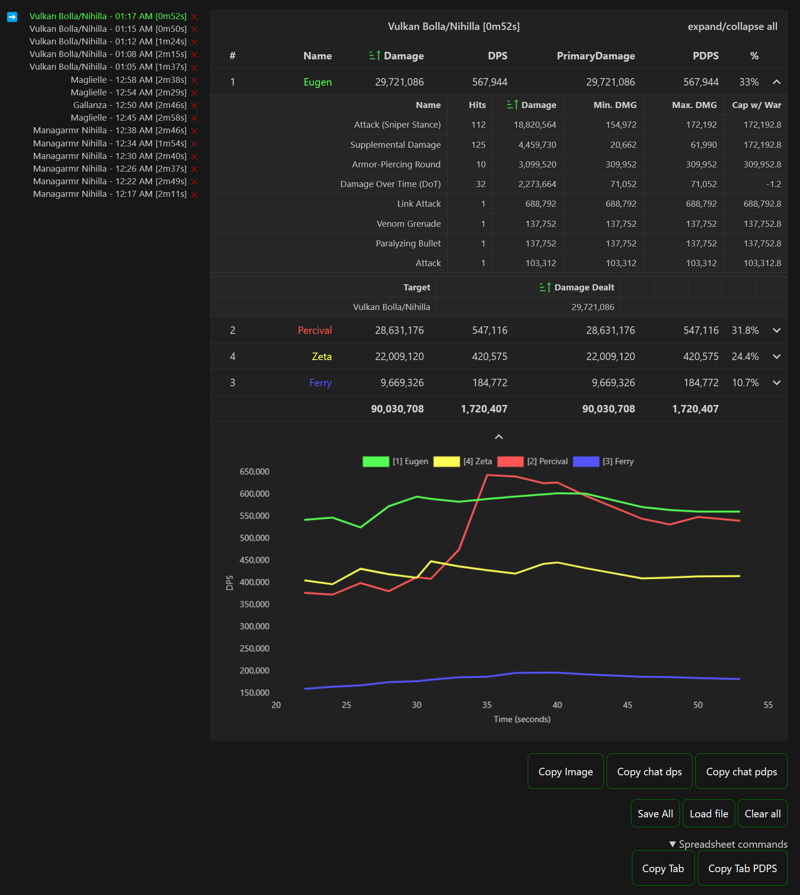

# gbfr-parser



## Download
You can download the latest version [here](https://github.com/dvorak321/gbfr-parser/releases).

## Running / Testing

Pre-requirements:
- Python 3.11 or above - [Download here](https://www.python.org/downloads/windows/)
  - Make sure to enable "Use admin privileges when installing py.exe" and "Add python.exe to PATH" during the installation.

After obtaining latest [release](https://github.com/dvorak321/gbfr-parser/releases), follow the instruction below

2 Approaches:
1. Separate GBFR / ACT launch
    - Launch [`./uac_start.cmd`](./uac_start.cmd)
    - Launch GBFR separately
    - Open `index.html` from release page, or build directory.
2. Linked Launch (Preferable, only for windows)
    - Copy [`./steam_win_start.cmd](./steam_win_start.cmd) to your release folder, example [picture](./img/ex1.png)
    - Set Steam launch option as follows `"C:\<Path-To-GBFR-Parser-Release>\gbfr-parser\<Release-Folder-Name>\steam_win_start.cmd" %command%`, example [picture](./img/ex2.png)
    - Launch GBFR from steam and it will automatically launch everything.
   
## Building this project

Pre-requirements
- Node.js - [Download here](https://nodejs.org/en/download)
- Yarn - [Installation instructions](https://classic.yarnpkg.com/lang/en/docs/install/#windows-stable)

You can build the views by running the following command:
```sh
git clone https://github.com/dvorak321/gbfr-parser # optional
cd gbfr-parser/views
yarn install && yarn build
```

The output should be inside the `gbfr-parser/views/build` directory.
